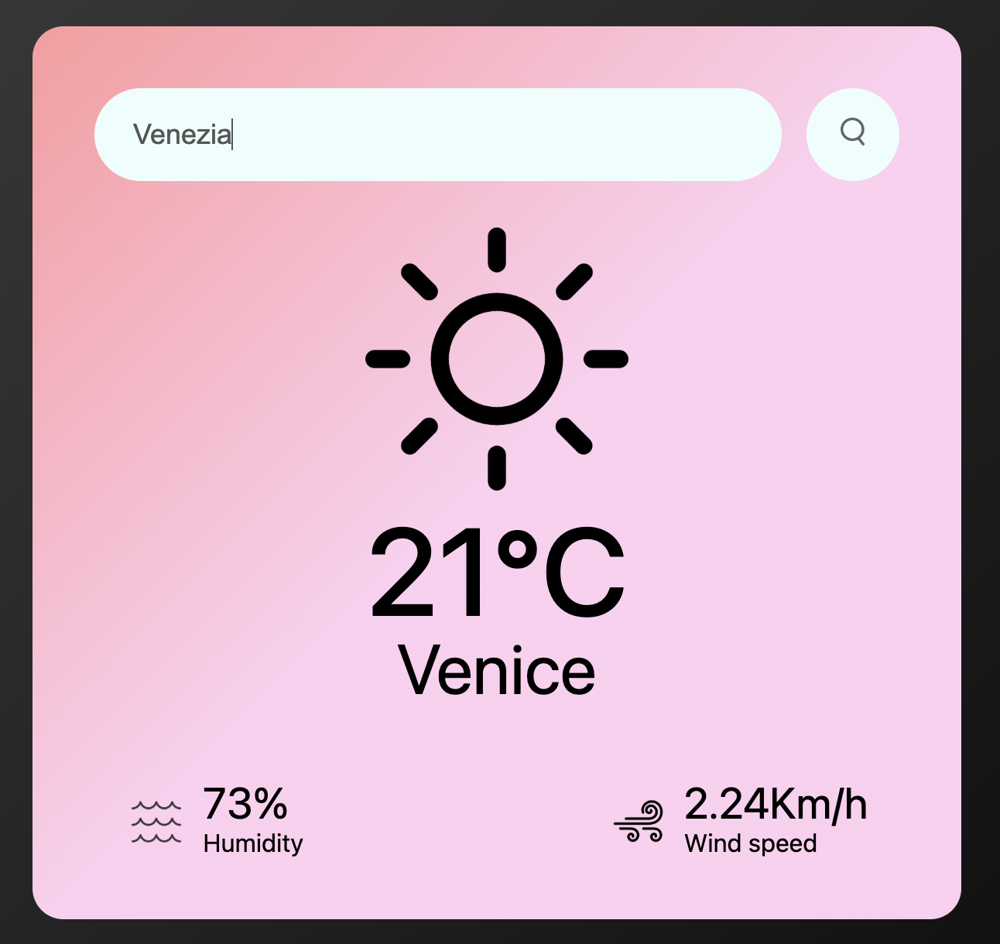

# 🌤️ Responsive Weather App



A simple and responsive **Weather App** built with **HTML, CSS, and JavaScript**.  
This project uses the **OpenWeatherMap Free API** to fetch real-time weather data and display information such as:

- 🌡️ Temperature  
- 🌥️ Weather condition  
- 💧 Humidity  
- 💨 Wind speed  

Users can search by **city name** using the search box, and the app will show the corresponding weather details.

---

## 🚀 Features
- Responsive design (works on desktop and mobile)  
- Real-time weather data from OpenWeatherMap API  
- Search box for city-based weather lookup  
- Clean UI with dynamic updates  

---

## 🛠️ Technologies Used
- **HTML5**  
- **CSS3** (Responsive design)  
- **JavaScript (ES6+)**  
- **OpenWeatherMap API**  

---

## 🔑 How to Use
1. Clone the repository:
   ```bash
   git clone https://github.com/tuo-username/WebApp-Meteo-html-css-js.git
